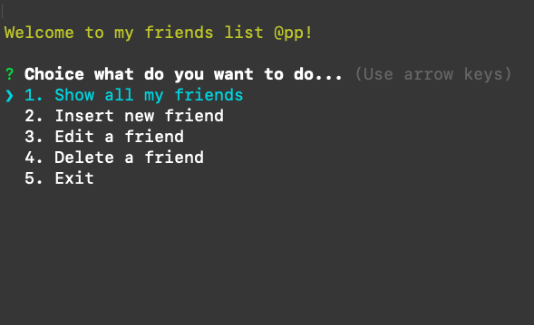

# Friends List App

This simple application has as its only functionality to create a list of friends, on which I will be able to list, delete, edit and insert friends.

I have created it by implementing Node.js and the latest ECMAScript 6 functionality, plus the following packages:

- Inquirer.js
- colors
- dotenv
- pg
- uuid

The database I have used was PostgresSQL, as you can confirm by your self.

**Postdata**: Recommended Node.js version: Nodejs >= v13.
